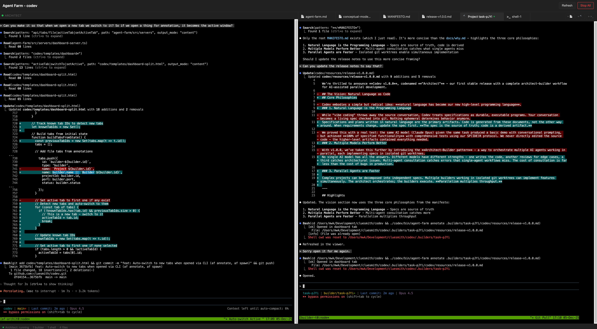
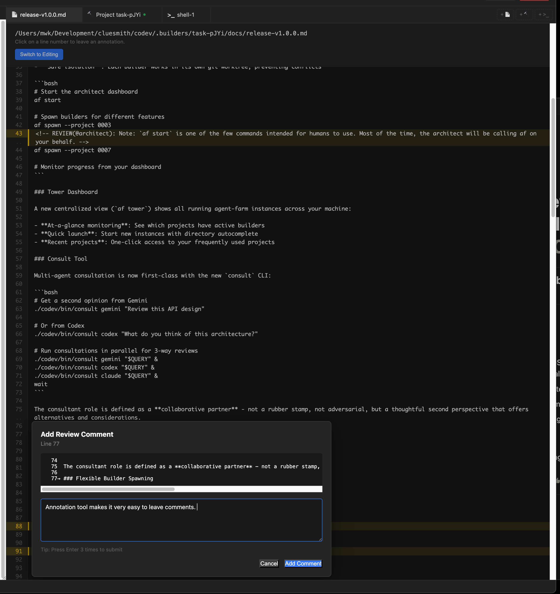

# Codev v1.0.0 "Architect" - Release Announcement

**Release Date**: December 5, 2025

We're thrilled to announce **Codev v1.0.0**, codenamed **"Architect"** - our first stable release with a complete architect-builder workflow for AI-assisted parallel development.



*The screenshot above shows Codev building itself: the Architect (left) orchestrates while a Builder (right) writes these release notes.*

## Core Philosophies

### 1. Natural Language is the Programming Language

Specifications and plans written in natural language are the primary artifacts. Code is generated from these documents, not the other way around. When requirements change, update the spec first. **The spec is the source of truth; code is a derived artifact.**

### 2. Multiple Models Perform Better

No single AI model has all the answers. Different models have different strengths - one writes the code, another reviews for edge cases, a third catches architectural issues. Multi-agent consultation catches errors that single-agent workflows miss. The cost of consultation is far less than the cost of bugs in production.

### 3. Parallel Agents are Faster

Complex projects can be decomposed into independent specs. Multiple builders working in isolated git worktrees can implement features simultaneously. The architect orchestrates; the builders execute. **Parallelism multiplies throughput.**

---

## Highlights

### The Architect-Builder Pattern

The centerpiece of v1.0.0 is a new paradigm for AI-assisted development. Read more in [The Architect-Builder Pattern: Scaling AI Development with Spec-Driven Teams](https://waleedk.medium.com/the-architect-builder-pattern-scaling-ai-development-with-spec-driven-teams-d3f094b8bdd0).

- **You + your primary AI are the Architect**: Create specs, plans, and review work
- **Builders are autonomous AI agents**: Implement specs in isolated git worktrees
- **Work in parallel**: Multiple builders can tackle different features simultaneously
- **Safe isolation**: Each builder works in its own git worktree, preventing conflicts

```bash
# Start the architect dashboard (one of the few commands intended for humans)
af start

# From here, the Architect AI calls af on your behalf:
# af spawn --project 0003
# af spawn --project 0007
# af status
```

### Tower Dashboard

A new centralized view (`af tower`) shows all running agent-farm instances across your machine:

- **At-a-glance monitoring**: See which projects have active builders
- **Quick launch**: Start new instances with directory autocomplete
- **Recent projects**: One-click access to your frequently used projects

### Consult Tool

Multi-agent consultation is now first-class with the new `consult` CLI:

```bash
# Get a second opinion from Gemini
./codev/bin/consult gemini "Review this API design"

# Or from Codex
./codev/bin/consult codex "What do you think of this architecture?"

# Run consultations in parallel for 3-way reviews
./codev/bin/consult gemini "$QUERY" &
./codev/bin/consult codex "$QUERY" &
./codev/bin/consult claude "$QUERY" &
wait
```

The consultant role is defined as a **collaborative partner** - not a rubber stamp, not adversarial, but a thoughtful second perspective that offers alternatives and considerations.

### Flexible Builder Spawning

The `af spawn` command now supports five modes for different workflows:

| Mode | Flag | Use Case |
|------|------|----------|
| Spec-driven | `--project 0003` | Implement a formal specification |
| Ad-hoc task | `--task "Fix the login bug"` | Quick fixes with natural language |
| Protocol | `--protocol cleanup` | Run maintenance protocols |
| Worktree | `--worktree feature/x` | Isolated branch without prompt |
| Shell | `--shell` | Bare bash session |

### Annotation Tool

Review and comment on files directly from the dashboard. Click any line to add a review comment - perfect for architect-builder communication.



### Interactive Tutorial

New to Codev? Run `af tutorial` for a step-by-step introduction:

- Learn the architect-builder workflow hands-on
- Progress tracking with skip/reset options
- Get productive in minutes, not hours

---

## Development Protocols

**SP(IDE)R** - Our flagship protocol for structured development:

- **S**pecify: Human and agents align on concrete acceptance criteria. Other agents (Gemini Pro, GPT-5) review for missing requirements, security concerns, architectural issues.
- **P**lan: Break implementation into phases with clear deliverables and exit criteria.
- **For each phase, run the IDE loop:**
  - **I**mplement: Build the code
  - **D**efend: Write tests that build defensive barriers against regressions
  - **E**valuate: Verify it meets spec, reflect on complexity and correctness
- **R**eview: Document lessons learned. Update the protocol itself based on what you learned.

The key differentiator is **multi-agent consultation** and **fixed human review points**. Each agent brings its own strengths and blind spots; the human has final say at key decision points.

**New protocols in v1.0.0:**

- **TICK**: Fast autonomous implementation for small features (Triage, Implement, Check, Klose)
- **CLEANUP**: Systematic codebase maintenance (AUDIT, PRUNE, VALIDATE, SYNC)

---

## The Conceptual Model

Codev uses a clear conceptual model for composable AI workflows:

```
Roles → Protocols → Skills
(Who)    (How)      (Tools)
```

- **Roles** (Architect, Builder): Persistent personas with judgment and priorities
- **Protocols** (SPIDER, TICK, CLEANUP): Multi-phase workflows that orchestrate work
- **Skills**: Atomic actions (git, tests, file operations)

The Builder role has been clarified: "building" encompasses build, remodel, repair, extend, validate, document, and maintain. Builders own the *artifact* - the complete, working result.

---

## Getting Started

Tell your AI agent:

```
Install Codev by following the instructions at https://github.com/cluesmith/codev/blob/main/INSTALL.md
```

Or follow the [Installation Guide](https://github.com/cluesmith/codev/blob/main/INSTALL.md) yourself.

### Recommended Alias

Add to your `~/.bashrc` or `~/.zshrc`:

```bash
alias af='./codev/bin/agent-farm'
```

Then:

```bash
af start           # Start architect dashboard
af tutorial        # Learn the workflow
```

---

## Join the Movement

Codev is self-hosted - we use Codev to build Codev. Every feature in this release went through SP(IDE)R. Every improvement has a specification, plan, and review. The pain points we feel become the next features we build.

Check our `codev/specs/` directory. Read the plans. Learn from our reviews. It's not just open source code; **it's open source methodology**.

The best methodologies emerge from collective practice, not ivory towers. If you try Codev:
- Star the [GitHub repository](https://github.com/cluesmith/codev) to stay updated
- [File issues](https://github.com/cluesmith/codev/issues) with your experiences
- Share your SP(IDE)R implementations - we analyze them to evolve the protocol
- Join [GitHub Discussions](https://github.com/cluesmith/codev/discussions) to share your specs and learn from the community

---

**Resources**

- [Why We Created Codev](https://github.com/cluesmith/codev/blob/main/docs/why.md) - The philosophy behind specification-driven development
- [Installation Guide](https://github.com/cluesmith/codev/blob/main/INSTALL.md) - For humans and AI agents
- [SPIDER Protocol Documentation](https://github.com/cluesmith/codev/blob/main/codev/protocols/spider/protocol.md)
- [GitHub Discussions](https://github.com/cluesmith/codev/discussions)
- [Full Changelog](https://github.com/cluesmith/codev/blob/main/CHANGELOG.md)

---

*Built with Codev - where context drives code*
